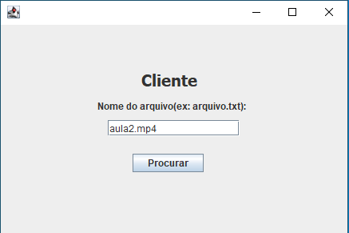
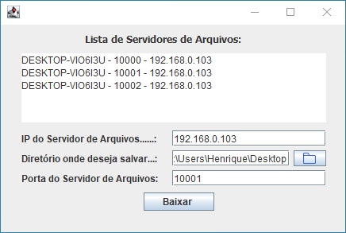
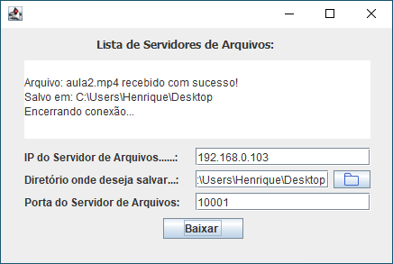

  
  

<h4 align="center"> 
	🚧 Servidor de Arquivos (Java) - Concluído 🚀 🚧
</h4>

## Sobre o projeto

O projeto Servidor de Arquivos foi desenvolvido por: <a href="https://github.com/rickweb3">Henrique Prado</a>, <a href="https://github.com/rickweb3">Rafael Antonio</a> e <a href="https://github.com/MarcosSD">Marcos Machado</a> na disciplina Sistemas Distribuídos do curso Sistemas de Informação da Universidade Federal de Sergipe - Campus Itabaiana.

---

## Projeto desenvolvido

 
 

---
